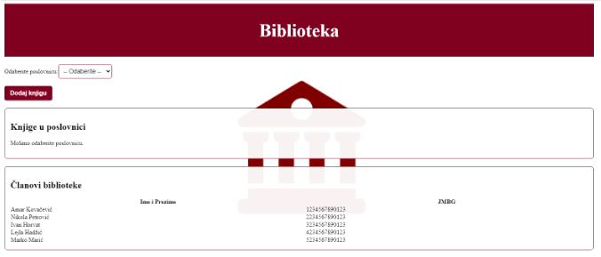

#  Library Overview Application

This web application is designed for **managing and tracking books across multiple library branches**, using **MySQL** for the database and **React.js** for the frontend. It is particularly suitable for organizations with more than one library location and multiple registered users.

---

##  **Main Features**

- 🔍 **Library Selection** – Users can select a specific library branch to view.
- 📚 **Book Overview** – Displays books available in the selected branch along with their availability status (checked out or available).
- ➕ **Add Books** – Users can add new books to the currently selected library.
- ✅ **Book Availability Check** – Users can easily check if a book is available or already borrowed.

The goal is to provide a simple and efficient interface for managing the core functions of a library system.

---

<div align="center">
  
</div>

---

##  **Steps to Run the Application**

To run the application locally, follow these steps:

### 1. **Backend Setup:**
   - Open a terminal and navigate to the `library-backend` directory:
     ```bash
     cd library-backend
     ```

### 2. **Start the Backend Server:**
   - Run the backend server with the following command:
     ```bash
     node index.js
     ```

### 3. **Frontend Setup (Open a New Terminal):**
   - In a new terminal, navigate to the `library-frontend` directory:
     ```bash
     cd library-frontend
     ```

### 4. **Set Environment Variable (for Windows):**
   - Set the legacy provider option:
     ```bash
     $env:NODE_OPTIONS="--openssl-legacy-provider"
     ```

### 5. **Start the Frontend Application:**
   - Launch the frontend application:
     ```bash
     npm start
     ```

This will automatically open the application in your default browser.

---

##  **Notes**

- The interface of the application is in **Bosnian**.
- The project uses **MySQL** for the database and **React.js** for the frontend.
- Ensure that you have **Node.js** and **npm** installed before proceeding.

---

##  **Technologies Used**
- **Frontend:** React.js
- **Backend:** Node.js, Express.js
- **Database:** MySQL
